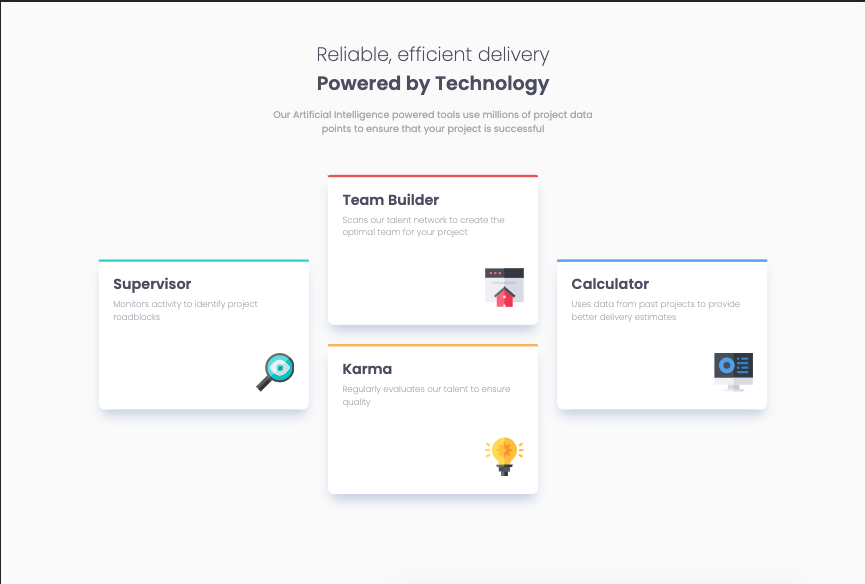

# Frontend Mentor - Four card feature section solution

This is a solution to the [Four card feature section challenge on Frontend Mentor](https://www.frontendmentor.io/challenges/four-card-feature-section-weK1eFYK). 

## Table of contents

- [Overview](#overview)
  - [The challenge](#the-challenge)
  - [Screenshot](#screenshot)
  - [Links](#links)
- [My process](#my-process)
  - [Built with](#built-with)
  - [What I learned](#what-i-learned)
  - [Continued development](#continued-development)
  - [Useful resources](#useful-resources)
- [Author](#author)
- [Acknowledgments](#acknowledgments)

**Note: Delete this note and update the table of contents based on what sections you keep.**

## Overview

### The challenge

Users should be able to:

- View the optimal layout for the site depending on their device's screen size

### Screenshot





### Links

- Solution URL: [https://github.com/kbrandon19/Four-Card-Feature-Section](https://github.com/kbrandon19/Four-Card-Feature-Section)
- Live Site URL: [https://kbrandon19.github.io/Four-Card-Feature-Section/](https://kbrandon19.github.io/Four-Card-Feature-Section/)

## My process

### Built with

- Mobile-first workflow
- Semantic HTML5 markup
- CSS custom properties
- Flexbox (x2)


### What I learned

The biggest thing would be remembering to include the, 
```css 
  content:"";
```
when using the ::before/::after pseudo-elements. I also learned how flexbox can simplify a lot within a design. I initally was going to use CSS Grids but after consideration I realized that it would have been over complicating the process when I can simply center the elements using 

```css
div{
justify-content:center;
align-items:center;
}
```,

then nest another flexbox within the center card.

### Continued development


I want to continue using before and after to become more familiar with it and how to use it in a functional way. Not only that but flexbox as well. 

Another problem that I feel like I face is naming conventions for classes, id, etc. I want to spend less time thinking of the best names to use and just actually continue with development.

### Useful resources

- [Flexbox Cheatsheet](https://yoksel.github.io/flex-cheatsheet/) - This helped me as a refresher and aid for flexbox. I use flexbox all the time but it's never a bad thing to had a reference in case help is needed.
- [::Before / ::after](https://css-tricks.com/almanac/selectors/a/after-and-before/) - This is an amazing article which helped me finally understand the usage and how it ties with design features.  


## Author

- Website - [Kenneth Brandon](https://www.your-site.com)
- Frontend Mentor - [@kbrandon19](https://www.frontendmentor.io/profile/kbrandon19)
- Twitter - [@mrdebonairfox](https://www.twitter.com/mrdebonairfox)


## Acknowledgments

I just want to acknowlege everyone that's doing these challenges and remain dedicated becuase even the simple things can humble the best web developer!

